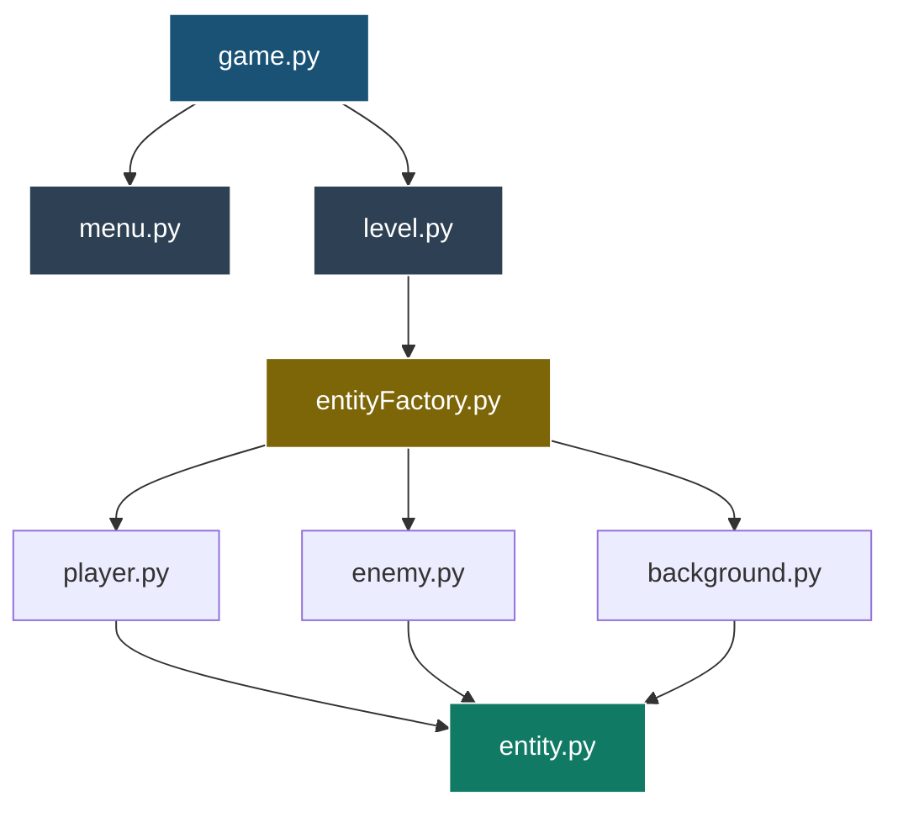

# Arquitetura do Jogo

```mermaid
graph TD
    game[game.py]
    menu[menu.py]
    level[level.py]
    factory[entityFactory.py]
    player[player.py]
    enemy[enemy.py]
    bg[background.py]
    entity[entity.py]

    game --> menu
    game --> level
    level --> factory
    factory --> player
    factory --> enemy
    factory --> bg
    player --> entity
    enemy --> entity
    bg --> entity

    style game fill:#1a5276,stroke:#fff,stroke-width:2px,color:#fff
    style menu fill:#2e4053,stroke:#fff,stroke-width:1px,color:#fff
    style level fill:#2e4053,stroke:#fff,stroke-width:1px,color:#fff
    style factory fill:#7d6608,stroke:#fff,stroke-width:1px,color:#fff
    style entity fill:#117a65,stroke:#fff,stroke-width:1px,color:#fff
```
