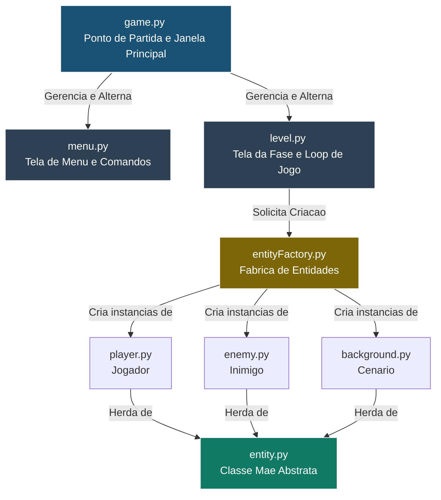

# Arquitetura do Jogo

```mermaid
graph TD
    game[game.py <br>Ponto de Partida e Janela Principal] -->|Gerencia e Alterna| menu[menu.py <br>Tela de Menu e Comandos]
    game -->|Gerencia e Alterna| level[level.py <br>Tela da Fase e Loop de Jogo]

    level -->|Solicita Criacao| factory[entityFactory.py <br>Fabrica de Entidades]

    factory -->|Cria instancias de| player[player.py <br>Jogador]
    factory -->|Cria instancias de| enemy[enemy.py <br>Inimigo]
    factory -->|Cria instancias de| bg[background.py <br>Cenario]

    player -->|Herda de| entity[entity.py <br>Classe Mae Abstrata]
    enemy -->|Herda de| entity
    bg -->|Herda de| entity

    style game fill:#1a5276,stroke:#fff,stroke-width:2px,color:#fff
    style menu fill:#2e4053,stroke:#fff,stroke-width:1px,color:#fff
    style level fill:#2e4053,stroke:#fff,stroke-width:1px,color:#fff
    style factory fill:#7d6608,stroke:#fff,stroke-width:1px,color:#fff
    style entity fill:#117a65,stroke:#fff,stroke-width:1px,color:#fff
```
