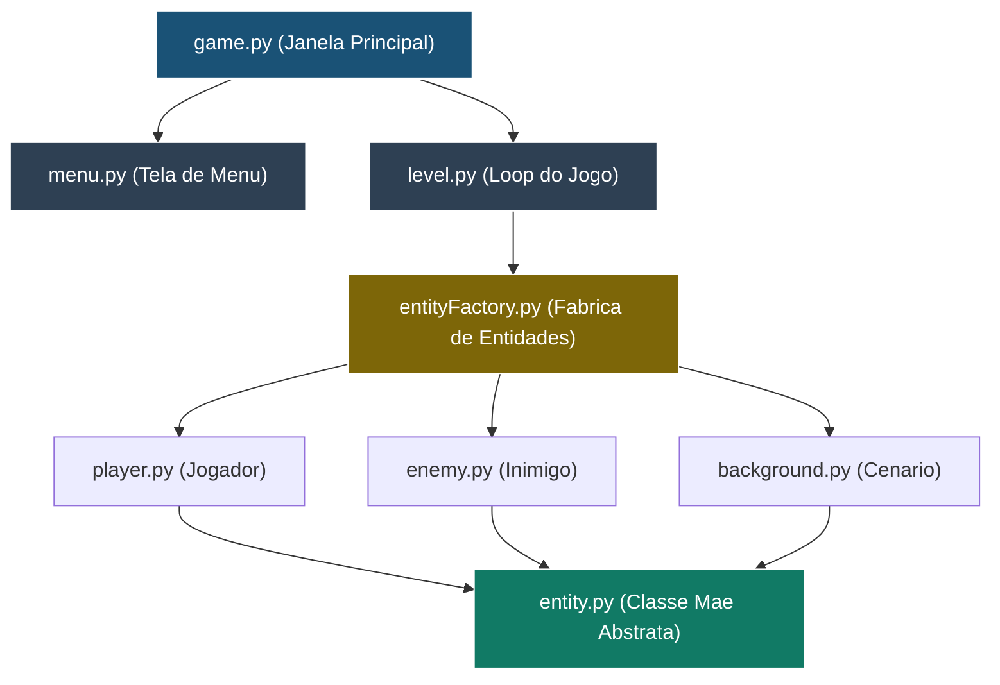

# Arquitetura do Jogo

```mermaid
graph TD
    game["game.py (Janela Principal)"]
    menu["menu.py (Tela de Menu)"]
    level["level.py (Loop do Jogo)"]
    factory["entityFactory.py (Fabrica de Entidades)"]
    player["player.py (Jogador)"]
    enemy["enemy.py (Inimigo)"]
    bg["background.py (Cenario)"]
    entity["entity.py (Classe Mae Abstrata)"]

    game --> menu
    game --> level
    level --> factory
    factory --> player
    factory --> enemy
    factory --> bg
    player --> entity
    enemy --> entity
    bg --> entity

    style game fill:#1a5276,stroke:#fff,stroke-width:2px,color:#fff
    style menu fill:#2e4053,stroke:#fff,stroke-width:1px,color:#fff
    style level fill:#2e4053,stroke:#fff,stroke-width:1px,color:#fff
    style factory fill:#7d6608,stroke:#fff,stroke-width:1px,color:#fff
    style entity fill:#117a65,stroke:#fff,stroke-width:1px,color:#fff
```
